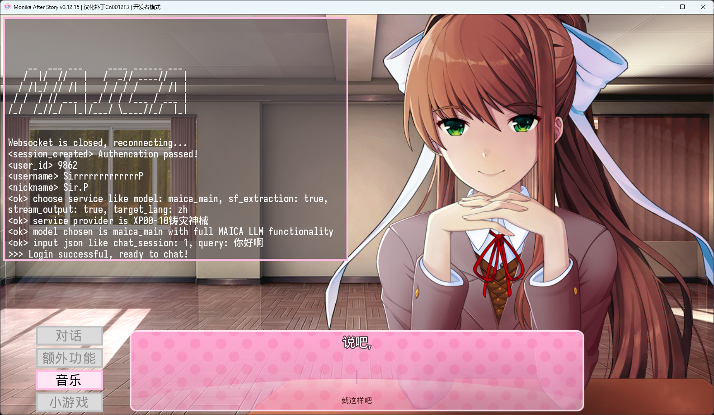

<h1 align="center">MAICA-光耀之地</h1>

***

中文 | <a href="/README_EN.md">English</a>

本页面是MAICA的指引页面, 当前位置是MAICA子模组前端仓库.

MAICA项目的详细介绍页是https://maica.monika.love/.

要快速开始或了解授权, 请参阅https://maica.monika.love/tos.

MAICA的后端仓库地址是https://github.com/Mon1-innovation/MAICA.

MAICA的子模组前端仓库地址是https://github.com/Mon1-innovation/MAICA_ChatSubmod.

MAICA LIA分支的模型地址是https://huggingface.co/edgeinfinity/MAICAv0-LIA-72B.

MAICA LOA分支的模型地址是https://huggingface.co/edgeinfinity/MAICAv0-LOA-7B.

MAICA的基本数据集仓库位于https://huggingface.co/datasets/edgeinfinity/MAICA_ds_basis.

MAICA的相关文档存储于https://github.com/Mon1-innovation/MAICA/tree/main/document.

请理解由于人力有限, 我们不在此对项目作额外介绍. 如需了解MAICA, 请前往上述详细介绍页面.

-------------------------

# MAICA Blessland

Blessland(光耀之地) 是 MAICA 的前端, 基于 MAICA 的聊天子模组.

> 注意: 需要一个 Doki Chinese Club 账号才能使用, 具体要求请查看[TOS](https://maica.monika.love/tos).

## 特色

* 完全自由的聊天, 你可以畅所欲言
* 能够获知(一部分)此前的陪伴经历
* 安装简单, 无须在自己的设备上部署任何模型
* 连续的上下文对话, 根据对话节奏自动分句
* 基于情感强度分析算法的表情解析
* 高可自定义化的参数设置
* 对SFE, MFocus, MSpire等独有功能的完全兼容
* 开源和二次开发友好
* 如果你愿意找的话, 有一些不小的彩蛋
  
## 安装

1. 确保使用的是最新汉化版本MAS.  
2. 从[Release](https://github.com/Mon1-innovation/MAICA_ChatSubmod/releases)处下载最新的版本.  
3. 关闭游戏, 将zip中的文件合并到您的`DDLC`/`MAS_CN001***/Monika After Story`文件夹内, 或者是`DDLC.exe`/`MAS.exe`所在的位置  
4. 可选择安装[Paste](https://github.com/Legendkiller21/MAS-Submods-Paste)（允许复制粘贴）和/或[Submod Updater Plugin](https://github.com/Booplicate/MAS-Submods-SubmodUpdaterPlugin)（允许通过游戏内更新程序更新 submods ）, 以改善使用体验

# 提示
1. 完整的功能只会在好感度达到100后开放.
2. 安装或达到条件后, 相关对话不会立刻解锁, 需要等待运行一段时间后推送.
3. 如果运行时出现任何异常情况, 尝试关闭自动重连和打开Console重试也许会有帮助.
4. 提供对中英双语的完整支持, 但模型在英语上的表现可能较弱, 也更可能发生功能上的故障.