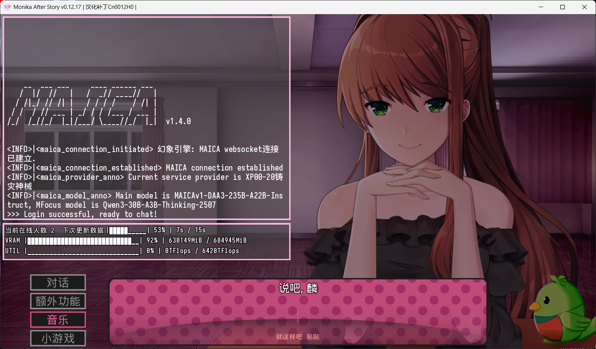
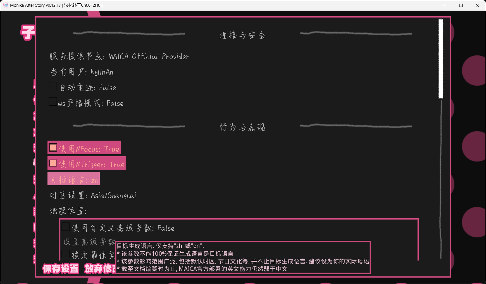

<h1 align="center">MAICA-Blessland</h1>

***

<a href="/README.md">中文</a> | English

This is the introduction page of MAICA Submod frontend.

MAICA contains multiple subprojects, find menu at https://github.com/Mon1-innovation/MAICA.

Please pardon for not putting an full instruction here, since it's too complicated. To know more about MAICA, navigate to instruction pages mentioned above.

-------------------------

# MAICA Blessland

Blessland is the Submod frontend of MAICA, a LLM project specially designed for Monika.

This repository introduction is very brief. If this is your first contact with MAICA, consider navigating to the introduction page at https://maica.monika.love/.

> Notice: You'll need an Doki Chinese Club account to use this, refer to [TOS](https://maica.monika.love/tos).
> Necessary instructions are provided in game too.

## Features

* Chat freely beyond MAS's native limits
* Carefully designed guidance, conversations and scenes
* Could acquire real world information(MFocus) and emit in-game actions(MTrigger)
* Could recall (part of) previous experiences of MAS
* Easy to go, no need to deploy any LLM stuff on your device
* Continuous and fluent chatting experience with automatic sentence breaks
* Expression parsing based on emotion and strength analyzation
* Topic generation(MSpire) and mail reading & writing(MPostal) functions offered
* Highly customizable options and parameters
* Open sourced, developers and users friendly
* Some easter eggs if you're interested in
* Still under active development and maintaince
  
## Usage

1. Use the latest version of MAS.
2. Download latest verion of Blessland at [Release](https://github.com/Mon1-innovation/MAICA_ChatSubmod/releases).
3. Quit the game, unzip and copy-paste the folders into `DDLC`/`MAS_CN001***/Monika After Story` folder, which is where `DDLC.exe`/`MAS.exe` lies in.
  > Do not unzip directly into Submods! You must merge it into the game's base path.
4. Optionally install [Paste](https://github.com/Legendkiller21/MAS-Submods-Paste) to allow in-game copy-pasting and [Submod Updater Plugin](https://github.com/Booplicate/MAS-Submods-SubmodUpdaterPlugin) to update submods in game, to improve using experience.

# Tips
1. Full functions will only be avaliable after affection reaches 100.
2. Unlocking events adds them to a waiting list, which means they won't be immediately triggered. Keep the game running and wait.
3. For troubleshooting, turning off 'Auto reconnect' and turning on 'Console' may help. Reconnect on options' change.
4. English/Chinese are fully supported. But the basic logics and trainings are based on Chinese, so expect performance reduction and higher possibility of functional issues by using English.
5. Does not support system http(s)/socks proxy. Turn it off.
6. You can delete `game\Submods\MAICA_ChatSubmod\donation` to hide donation link.