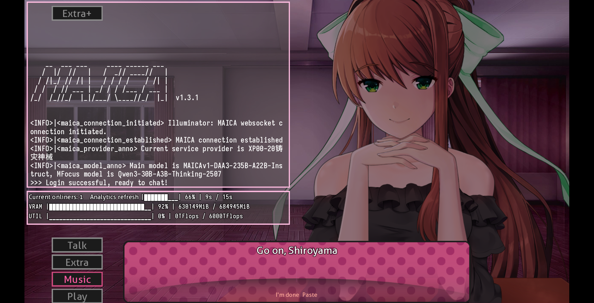
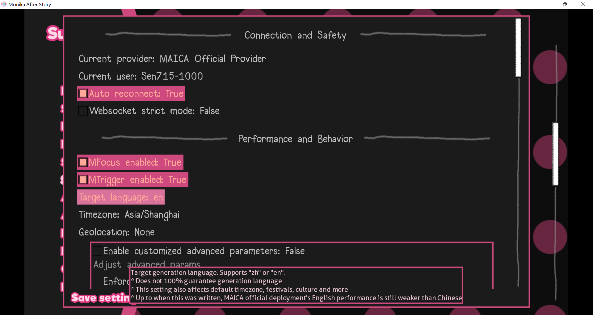

<h1 align="center">MAICA-Blessland</h1>

***

<a href="/README.md">中文</a> | <a href="/README_EN.md">English</a> | 日本語

これはMAICA Submodフロントエンドの紹介ページです。

MAICAには複数のサブプロジェクトがあります。メニューはこちら：https://github.com/Mon1-innovation/MAICA

詳細な説明をここに記載していないことをお詫びします。内容が非常に複雑なためです。MAICAについて詳しく知りたい方は、上記の説明ページをご覧ください。

-------------------------

# MAICA Blessland

Blesslandは、モニカ専用に設計されたLLMプロジェクト「MAICA」のSubmodフロントエンドです。

このリポジトリの説明は非常に簡潔です。MAICAに初めて触れる方は、https://maica.monika.love/ の紹介ページをご覧ください。

> 注意：利用にはDoki Chinese Clubアカウントが必要です。[利用規約](https://maica.monika.love/tos)をご参照ください。
> 必要な説明はゲーム内でも提供されています。

## 機能

* MASのネイティブ制限を超えた自由なチャット
* 丁寧に設計されたガイダンス、会話、シーン
* 現実世界の情報取得（MFocus）とゲーム内アクションの実行（MTrigger）が可能
* MASでの過去の体験（一部）を思い出すことが可能
* 簡単に始められる、デバイスにLLM関連のものをデプロイする必要なし
* 自動文分割による連続的でスムーズなチャット体験
* 感情と強度分析に基づく表情解析
* トピック生成（MSpire）とメールの読み書き（MPostal）機能を提供
* 画像やMMS（MVista）の送信に対応
* 高度にカスタマイズ可能なオプションとパラメータ
* オープンソース、開発者とユーザーに優しい
* 興味があれば、いくつかのイースターエッグも
* 現在も積極的に開発・保守中

## 使用方法

1. MASの最新バージョンを使用してください。
2. [Release](https://github.com/Mon1-innovation/MAICA_ChatSubmod/releases)からBlesslandの最新バージョンをダウンロードしてください。
  > このSubmodはオンラインサービスに依存して動作します。古いバージョンは廃止される可能性があるため、最新版を使用してください。
3. ゲームを終了し、解凍して`DDLC`/`MAS_CN001***/Monika After Story`フォルダにコピー＆ペーストしてください。これは`DDLC.exe`/`MAS.exe`があるフォルダです。
  > Submodsフォルダに直接解凍しないでください！ゲームのベースパスにマージする必要があります。
4. 配布物にはGitHub Actionsで生成されたコンテンツが含まれているため、現在`Submod Updater Plugin`経由での更新は推奨されていません。

# ヒント
1. 全機能は好感度が100に達した後にのみ利用可能になります。
2. イベントのアンロックは待機リストに追加されるため、すぐにはトリガーされません。プレイしながらお待ちください。
3. トラブルシューティングには、「自動再接続」をオフにし、「コンソール」をオンにすると役立つ場合があります。オプションの変更を反映するには再接続してください。
4. 英語/中国語は完全にサポートされていますが、英語を使用すると性能低下や機能的な問題が発生する可能性が高くなります。
5. システムのhttp(s)/socksプロキシには対応していません。オフにしてください。
6. `game\Submods\MAICA_ChatSubmod\donation`を削除すると、寄付リンクを非表示にできます。
